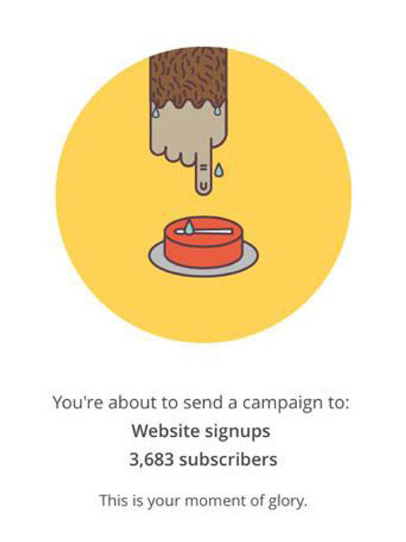
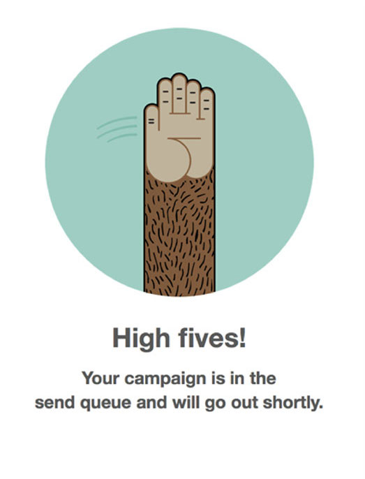
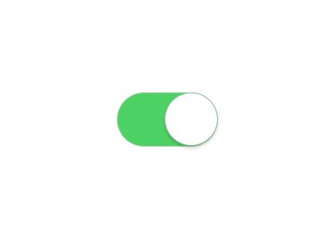
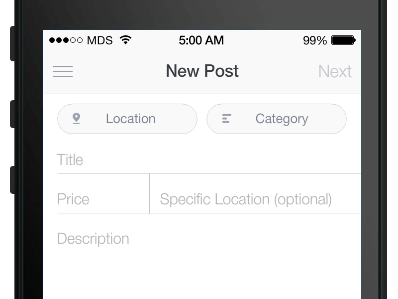

https://www.youtube.com/watch?v=n9TWwG4SFWQ

---

# Frank Chimero 

**What Screens Want**

https://www.youtube.com/watch?v=C65tiyH74D0&t=18m11s

---

# Animatsioon operatsioonisüsteemides

Apple Human Interface Guidelines 1987

---

---

# Animatsioon operatsioonisüsteemides

Apple Human Interface Guidelines 1987

> People appreciate visual effects, such as animation, that show that a requested action is being carried out. This is why, when a window is closed, it appears to shrink into a folder or icon. Visual Effects can also add entertainment and excitement to programs that might otherwise seem dull. Why shouldn’t using a computer be **fun**?

---

https://www.youtube.com/watch?v=c20uhGxSxWo

---

https://www.youtube.com/watch?v=z3-yhLASGAU

---

https://www.youtube.com/watch?v=p4gmvHyuZzw

---

# Samal ajal veebis

https://www.apple.com/hotnews/thoughts-on-flash/

Steve Jobs, 2010 aasta aprill

&nbsp;

https://www.smashingmagazine.com/2010/05/html5-and-flash-why-its-not-a-war-and-why-flash-wont-die/

2010 aasta mai

---

# Veeb ja animatsioon 2017

CSS / JS / WebGL / React Motion / Vue 2

GPU / 60fps

Tehnoloogia taha asi ei jää

---

# Disney

**12 animatsiooniprintsiipi**

https://vimeo.com/93206523

---

# Issara Willenskomer

**12 kasutajaliideste animatsiooniprintsiipi**

https://medium.com/ux-in-motion/creating-usability-with-motion-the-ux-in-motion-manifesto-a87a4584ddc

---

---

---

---

---

---

### Easing 

https://codepen.io/juliangarnier/full/mWdraw/

http://dynamicsjs.com/

http://cubic-bezier.com (Lea Verou)

---

---

---

---

---

---

---

---

---

---

---

---

---

---

---

---

---

---

---

---

---

---

---

---

---

---

---

---

---

# Animatsiooniinspiratsioon

https://uimovement.com/

https://motioncorpse.tumblr.com/

https://vimeo.com/160982669

---

# Animatsiooni ülekasutus või kultuuriline eripära?

Kas Flash on tagasi?

---

https://mahno.com.ua/en/about

---

---

# Animatsioon ja bränd

&nbsp;

---

https://www.ibm.com/design/language/experience/animation/elements/

---

https://www.youtube.com/watch?v=IYyRpZglZP4

---

https://www.youtube.com/watch?v=8Zw2WQzLljc

---

https://vimeo.com/162711355

---

https://vimeo.com/162712539

---

# Kasutajakogemus ja aju

Donald Norman "Emotional Design"

---

---

# Kasutajakogemus ja aju

limbic system / visceral mind: / "Äge näeb välja"

neocortex / analytical mind / "Täita hästi töötab"

mid-brain / _**emotion**_ / "See muutis mu elu"

---

---

---

# Mailchimp

---

---

---

---

---

---

---

---

# Mailchimp

Aarron Walter

"We’ve heard from some users who want the app to be more buttoned up and “professional.” We actually created a special mode in the app called “party pooper mode” that people can turn on to satisfy the frumpiest of bosses. As it turns out, only 0.007 percent of our users turn it on."

---

---

# 404 lehed

https://github.com/404

https://www.airbnb.com/404

https://www.uber.com/404

---

# 404 lehed

https://www.bloomberg.com/404

http://www.whatisfailwhale.info

https://www.figma.com/404

---

# Mikrointeraktsioonid

Dan Shaffer

---

---

> iPhone’s mute switch

---

# Pull to refresh

**Loren Brichter**

---

---

# Pull to refresh

https://youtu.be/Emk65QW9BmM?t=44s

---

---

---

http://littlebigdetails.com/

---

http://apps.thecodepost.org/trex/trex.html

---

# Mis see muudab?

-> UX prototyping outdated
Wireframing 💀

New tools!
GIFs!

http://www.prototypingtools.co/

https://marvelapp.com/
https://proto.io
http://www.adobe.com/products/experience-design.html
https://www.justinmind.com
https://www.atomic.io
https://prottapp.com
https://www.figma.com + framer
https://www.sketchapp.com/ + craft plugins
https://www.invisionapp.com/
http://origami.design/
https://material.io/stage/

https://airbnb.design/introducing-lottie/

---

# Redlining

---

---

---

---

---

---

https://vimeo.com/191321820

---

https://material.io/guidelines/layout/metrics-keylines.html#metrics-keylines-keylines-spacing

---

# Style guides + Patterns

---

# Style guides

https://www.kickstarter.com/projects/thestandardsmanual/reissue-of-the-1975-nasa-graphics-standards-manual

---

https://standardsmanual.com/pages/original-nycta

---

http://powerbranding.ru/wp-content/uploads/2013/11/adobe-brandbook.pdf

---

http://download.skype.com/share/blogskin/press/skype_brandbook.pdf

---

# Patterns

---

---

http://library.uniteddiversity.coop/Ecological_Building/A_Pattern_Language.pdf

---

---

https://medium.com/tangible-ux/a-history-of-patterns-in-user-experience-design-f21f7eaabb83

 -> link

https://yuilibrary.com/

1995

Jenifer Tidwell

https://alistapart.com/article/responsive-web-design

Ethan Marcotte

---

---

---

https://current.innovatemap.com/on-the-current-state-of-design-systems-in-ux-4cd0aa1fad71

These things don’t manage themselves. UI standards evolve, aesthetic norms change. Even a fully optimized and automated system will be hard to keep up. Often it can take a full year to have even an MVP built for a design system. By the time you build additional components or templates, the landscape has changed.

In times of growth and experimentation, temper the desire to systemize design. Instead, accept inevitable change, and build the design system when you need scale.

Design is a unique field which blends art and science but with its own mix of abductive reasoning and speculation that can lead to unpredictably amazing solutions. Implementing design systems in organizations must be done with care so as to optimize the right parts, while still offering the creative, untethered freedom design needs to explore. We should all be so lucky to nurture a product to the point where design systems are critical. But until that happens I advocate caution and keep focus on innovation.

---

http://www.bbc.co.uk/gel
https://vmware.github.io/clarity/
https://www.lightningdesignsystem.com/
https://www.ibm.com/design/language/
https://polaris.shopify.com/
http://design-system.lostmy.name/

http://styleguides.io/

http://mina.codes/articles/pantsuit-the-hillary-clinton-ui-pattern-library/

---

https://stuffandnonsense.co.uk/blog/about/designing-inspired-style-guides-presentation-slides-and-transcript

---

https://medium.com/@NateBaldwin/anatomy-of-a-design-system-7a6b0677bf5

map

---

https://medium.com/eightshapes-llc/patterns-components-2ce778cbe4e8

* Name
* Problem Statement
* Sensitizing Picture (always at the top)
* Use When (and often Don’t Use When)
* Guidelines rich with examples and scenarios

pattern

oo

**Patterns** describe how something SHOULD work under preferred conditions and suggestions of how to cope with tradeoffs.
Patterns may be UI or a variety of other things, like a behavior, flow, application motif or something else.

**Components** are how something DOES work, inclusive of tradeoffs and constraints realized through a build process.
Components are an interface chunk to be added to an overall layout. 

2010 Bootstrap, Foundation

2011 Anna Debenham 
https://24ways.org/2011/front-end-style-guides/
* Easier to test 
* Better workflow
* Shared vocabulary
* Useful reference

2013 Mailchimp
http://us5.campaign-archive1.com/?u=7e093c5cf4&id=ead8a72012&e=ecb25a3f93

---

https://medium.com/@marcintreder/the-minimum-viable-design-system-75ca1806848a

The style guide is an **artifact**, the design system is a **process**.

**Design system** is a process and therefore is simultaneously always ready and never done.

**-> Design ops**

The more inconsistent the user experience, the slower product development 

Of course, users suffer the most. A Google Research study from 2012 showed that users prefer simple interfaces, which seem familiar. They seek out experiences consistent with other experiences on the platform. We crave familiarity. Every new pattern responsible for the same action, or visual inconsistency, creates an unnecessary pause and an eventual burden.
Consistency introduces feelings of safety and familiarity. Inconsistency creates chaos and confusion.

---

http://cssstats.com/stats?url=http%3A%2F%2Film.ee&ua=Browser%20Default

http://cssstats.com/stats?link=http%3A%2F%2Ftartu.ee%2Fthemes%2Fcustom%2Ftartu%2Fstatic%2Fstyles%2Fdefault.css

http://cssstats.com/stats?url=http%3A%2F%2Fcity24.ee&ua=Browser%20Default

---

# Making it

Audit

https://medium.com/eightshapes-llc/space-in-design-systems-188bcbae0d62
https://medium.freecodecamp.com/how-to-construct-a-design-system-864adbf2a117

Space

Button

font, medium, 32px height, shadow, blue

---

---

https://www.smashingmagazine.com/atomic-design-workflow/

* lead to cohesive, consistent experiences: users master your UI faster, leading to more conversions and more money
* speed up your team’s workflow
* establishes a shared vocabulary /  creates a more collaborative workflow
* make cross-browser/device, performance, and accessibility testing easier
* serves as a future-friendly foundation

Lego

---

# Problems

https://blog.prototypr.io/atomic-design-in-practice-does-it-work-9655bacb49d7

Isolation

As soon as patterns are combined into layouts the temptation quickly becomes to use that as the reference point and avoid the individual (perhaps non-representative) pattern views.

Frankenstein’s monster

Having a toolkit of pre-made patterns makes it very tempting to cobble together a solution instead of devising something more appropriate from scratch.

Adaptability

Components have no knowledge of their own width, problematic if they’re going to be dropped into different containers.

---

Future

https://airbnb.design/painting-with-code/
http://www.jon.gold/2016/06/declarative-design-tools/
http://www.jon.gold/2016/05/robot-design-school/
http://github.com/jongold

https://runemadsen.com/blog/
https://programmingdesignsystems.com
https://runemadsen.com/talks/uxcampcph/

https://viljamis.com/2017/design-tools-processes/

---

Styleguides

https://atlassian.design/guidelines/brand/color-1

---

UI specs

https://www.smashingmagazine.com/2016/08/pixel-perfect-specifications-without-the-headaches/

---

# Dark patterns

http://preview.addconnectionssettlement.com/media/382686/second_order_on_mtd_in_linkedin.pdf

https://twitter.com/madebypaul/status/862113704032194560/photo/1?ref_src=twsrc%5Etfw&ref_url=https%3A%2F%2Fdarkpatterns.org%2Fhall-of-shame

---

http://apps.thecodepost.org/trex/trex.html

---

http://tubikstudio.com/creative-motion-12-concepts-of-interface-animation/

Medical

calc

---

https://material.io/guidelines/motion/creative-customization.html#creative-customization-icons

---

http://fluent.microsoft.com/
https://developer.microsoft.com/en-us/windows/apps/design

https://developer.microsoft.com/en-us/windows/apps/design

---

---

http://rosenfeldmedia.com/books/designing-interface-animation/

---

https://design.google.com/articles/making-motion-meaningful/

---

animate on button

---

> https://www.youtube.com/watch?v=Q4R7dDtLYgU
https://independent.academia.edu/HelmutLeitner

> file:///Users/kristjanjansen/Downloads/Front-end_Style_Guides_-_Anna_Debenham.pdf

---

https://vimeo.com/184237467

---

https://medium.com/ge-design/ges-predix-design-system-8236d47b0891

principles

basics

components

template

feature

application

---

https://react.semantic-ui.com/views/card

---

Joonistused

https://cdn-images-1.medium.com/max/1800/1*WXfRt7TkMsIifor5M4aA7A.jpeg
https://medium.com/buildit/design-system-architecture-a10e7b3aa30f

https://www.smashingmagazine.com/wp-content/uploads/2015/12/04-one-deliverable-opt-preview.png

https://cdn-images-1.medium.com/max/1440/1*Bp4eHmFtS5pfdPHv4pEwdQ.png

---

# Kasutajaliideste kavandamine

### MTAT.03.032

---

R 19. mai, kolmas kohtumine

---

# Slaidid

### http://kristjanjansen.ee/kasutajaliidesed3

&nbsp;

---

# Kursuse osad

|||
|----|----|----|
|_**R 21. aprill**_|_**Visuaalne disain**_|
|_**R 28. aprill**_|_**Interaktsioonidisain**_|
|_**K 17.mai 12:00**_|_**Kodutöö esitamine**_|
|**R 19. mai**|Disaineri tööprotsess|
|**R 26. mai**|Kasutajaliideste tulevik|

----

https://wereallmadinhere.wordpress.com/2013/02/20/hand-shaped-door-knockers-a-short-history/

common faith
https://www.youtube.com/watch?v=FXUW8qbbcHw

Hitler

---

---

# Deconstruction

---

---

---

